<script src="https://cdn.jsdelivr.net/gh/atteggiani/animated-terminal/animated-terminal.min.js" defer></script>

# AUS2200 - A complete guide

## Background

The AUS2200 model is a 0.0198 degree (2.2km at the equator) Unified Model vn12.2 (RAL3) or vn13.0 (RAL3.2) configuration

This page assumes a familiarity with the general structure of rose-cylc suites and is not intended as a rose-cylc tutorial. 

## Setup
In order to start running AUS2200, the user must have access to the UKMO Shared Repository Service (MOSRS). The user must also have access to the following projects:

* `rt52` - ERA5 data
* `zz93` - ERA5-Land data
* `hh5` - analysis software environment
* `access` - `$UMDIR` and um2netcdf4 library

### Ancillary files
The ancillary suite has the ID `u-cp145`. This suite determines the domain and resolution of the model. The suite produces two sets of ancillaries, one for the primary model domain and a second for the region encapsulating the frames used as the spatial boundary conditions. The centre of the model domain can be set in the "Nested region 1 setup" section of the rose config editor
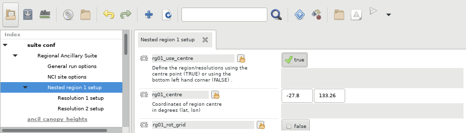
and the size of the boundary domain and model domain can be configured in the "Resolution 1" and "Resolution 2" respectively.
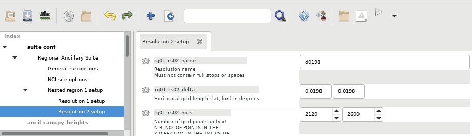

The values in the screenshots above show the settings for the production AUS2200 domain. The ancillary suite output requires approximately 1.5TB of storage and completes in around 2 hours. Once complete, the ancillaries can be found in `~/cylc-run/u-cp145/share/data/ancils`. Note that this will be a symlink onto `/scratch`, so the appropriate `-lstorage=` flag will needed to be added to the model suite in order to ensure access to the ancillaries.

### Resource requirements
Before committing to any production runs, it is important to ensure that adequate resources are in place. The full AUS2200 domain requires approximately 16kSU and 300GB of permanent storage per model day. In addition, it is advisable to keep at least 5TB available for interim storage for boundary conditions and UM format output files.

## The AUS2200 suite
The reference AUS2200 suite has the ID `u-cs142`. Though derived from the standard Regional Nested Suite (see e.g. [Regional Practical 2023](https://code.metoffice.gov.uk/trac/jumps/wiki/RegionaPractical2023)), the AUS2200 suite contains a number of changes designed to optimise the suite workflow. The model runs, whether continuous or restarted, are divided into 6 hour cycles, with the task graph for each cycle represented in the following image

```{image} ../Images/AUS2200/suite-overview.png
:alt: suite overview
:width: 700px
:align: center
```

### Cold start tasks
The tasks `install_cold_idl` and `install_cold_hpc` symlink the appropriate STASH master, ancil configurations and prebuilt software into the suite share directory. In this version of the suite, the `install_ec_startdata` task does nothing as the initial conditions are derived from data already present on disk.

### `fcm_make_um`
This task builds the Unified Model in the rose suite share directory. It is recommended to only run this task once, and have every other variant of the AUS2200 suite use the existing initial build. This can be configured in 'General run options' section of the rose config editor.

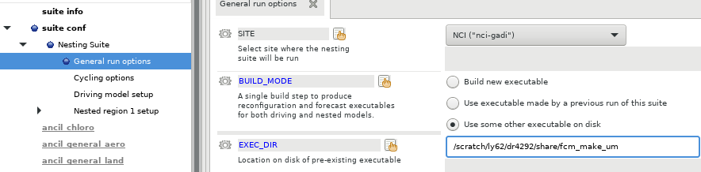

### `get_lbc_from_archive`
This task attempts to retrieve the spatial boundary conditions for the upcoming model run from the directory specified by the following set of jinja2 variables:
```
ARCHIVE_DIR = {{BC_ARCHIVE_DIR}}/{{mod["lbc_freq"][0]}}/{{NLBC_TIMES}}
```
Where 
 * `{{BC_ARCHIVE_DIR}}` is a top-level directory specified in `rose-suite.conf`
* `{{mod["lbc_freq"][0]}}` is the frequency with which the boundary is synchronised with the top-level domain run in seconds
* `{{NLBC_TIMES}}` is the number of times the boundary conditions will be syncrhonised within a model run. 

This is to ensure that should the run length or boundary synchronisation periods are modified at any time, the incorrect boundary conditions will not be re-used. 

This task is used to determine whether to generate boundary conditions at all. If the boundary conditions are successfully retrieved from the archive directory, the tasks associated with the driving model required to create the boundary conditions will not run. The exception to this is in the initial cycle point, where a new input dump also needs to be created from the driving model. 

```{note}
This task will fail if the boundary conditions do not exist. **This is intentional**. cylc7 suites do not support multiple paths through task graphs except in response to task failure.
```
Should the boundary conditions not be present, this task will be marked as failed and the driving model tasks will run. Once the driving model tasks are completed, the failed `get_lbc_from_archive` task is deleted and the workflow can proceed. This task is not run if `Archive LBCS` is set to false in the 'Driving model setup' section of the rose suite configuration (`{{ARCHIVE_LBCS}}` in `rose-suite.conf`)

### `nci_era5grib`
This task converts ERA5 and ERA5Land data to GRIB format in order to be used as input into the driving model reconfiguration tasks. This task will run on the initial cycle point of a suite, and when archived boundary conditions have not been found in any other cycle point. By default, this task saves the converted grib files to a central working directory outside of the cylc-run directory. This acts as an archiving task, and the converted grib files will not be re-created if they already exist. This directory is given by `{{dm_ec_ic_lbc_dir}}` in both `rose-suite.conf` and the rose suite configuration.

The runtime for this task is variable, if all grib files are already present, then it completes in a few seconds. If none of the grib files are present, this task can take from 10 minutes to almost an hour. Unfortunately the cause of this variability is not known. 

The configuration settings for this task and for `get_lbc_from_archive` can be found in the 'Driving model setup' section of the rose config editor

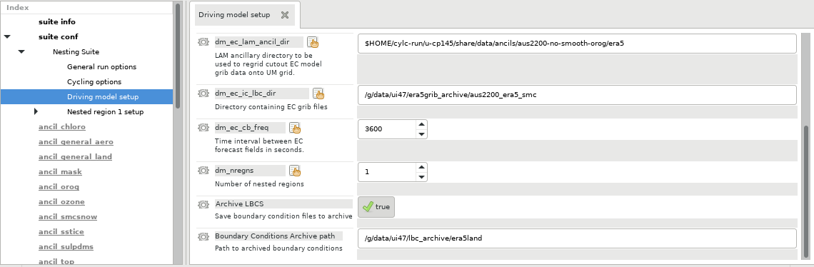

### `ec_recon_nnn`
This is the primary driving model reconfiguration task. It creates output files on two domains, the initial AUS2200 domain, and a slightly larger domain of the same resolution that acts as the spatial boundary conditions as the model progresses. One of these tasks is run for each point in the model at which the boundary conditions are synchronised, including the initial and final timesteps. In the default configuration, this means seven tasks per 6 hour cycle. These tasks are not run if the `get_lbc_from_archive` task in the same cycle completed successfully. The exception to this is in the inital cycle, where `ec_recon_000` is run in order to create the initial dump file for the model run.

By default these tasks are configured to run on 2 Sapphire Rapids nodes (`normalsr` queue, 208 cpus) each and complete in approximately 38 minutes. The tasks are independent, and are configured to run in parallel. This block of tasks is the second most expensive task set of the workflow, at a cost of about 1.8kSU/cycle. The output is saved to `{{CYLC_SUITE_SHARE_DIR}}/cycle/{{CYLC_TASK_CYCLE_POINT}}/ec/um`, and can be cleared after the forecast task has been completed.

### `aus2200_d0198_RA3_um_createbc_000`
This task takes the driving model reconfiguration output and creates the boundary 'frames' that are read by the model every hour to synchronise along the spatial boundaries. These frames are fairly small and data-derived, therefore are ideal for re-use in the 'restart' run mode where spin-up times and model runtimes overlap. This task is not run if the `get_lbc_from_archive` task in the same cycle was successful. The task takes approximately 5 minutes to complete on a single core.

### `put_lbc_to_archive`
This task archives the boundary conditions created by `aus2200_d0198_RA3_um_createbc_000` to the directory determined above in the `get_lbc_from_archive` task. Note that there is a race condition between testing whether archived boundary conditions are available, to this task running. When running overlapping restart suites, it is best to ensure that the same cycle point is not running in two different suites to avoid this race condition. This task is not run if `Archive LBCS` is set to false in the 'Driving model setup' section of the rose suite configuration (`{{ARCHIVE_LBCS}}` in `rose-suite.conf`)

### `recover_sst`
This task retrieves the sea-surface temperature from input dump file created by the `ec_recon_000` task. This is necessary as there is an error in the sea ice concentration in the dump file caused by the interpolation from the low-resolution ERA5 dataset, combined with the `era5grib` library's handling of missing values. This can be summarised visually in the following images (Right image created by Martin Dix)

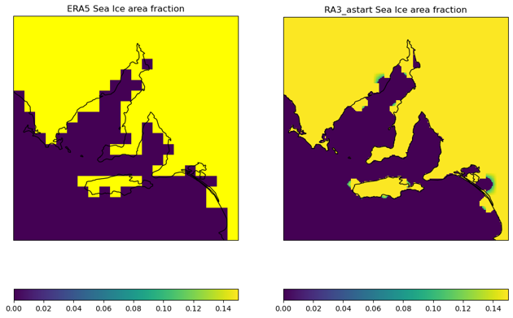

Any of the large resolution pixels that the reconfiguration task has determined to contain more than some fraction of ocean is treated as an ocean point with a sea ice fraction of about 14%. This error is rectified by restoring the sea ice fraction from the ancillary files, however the UM cannot do this without also loading the sea surface temperature from an ancillary file. This task ensures the sea surface temperature is not modified. The addition of these ancillary files into the input dump is controlled by the `2` and `3` entries under 'Configure ancils and initialise dump fields' section of the rose suite configuration

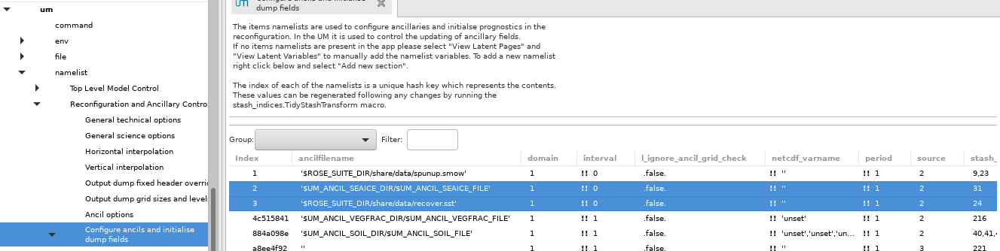

### `create_soil_moisture_ancil`
This task is used to carry over soil moisture from a previous run of the suite. When performing restart runs, it is advisable to carry the soil moisture through the entire run, as soil moisture has a much longer spin-up time than atmospheric processes. The restart run procedure is explained in more detail in the [Restart and Spinup](#restart-and-spinup) section below. This task is used to partially serialise restart runs, it can be submitted at any time and will wait until the correct dump file has been created from a previous run of the suite before creating the soil moisture ancillary file. The addition of this ancillary file into the input dump is controlled by the `1` entry under 'Configure ancils and initialise dump fields'.


 The creation of this ancillary file is controlled by the `SOIL_MOISTURE_CARRYOVER` setting under 'Cycling options' under the 'Nesting Suite' area in the rose suite configuration.
 
 Note that if this is set to false, the addition of the soil moisture field must be removed from the input dump. This is done by right-clicking on the row in the 'Configure ancils and initialise dump fields' area and selecting 'Ignore this section'.

### `aus2200_d0198_RA3_um_recon`
This is the main reconfiguration task for creating the model input dump. It is run once per suite, and for the remainder of the cycle points, the output dump is fed directly into the model as the input dump for the next cycle. This job is configured to run on 2 sapphire rapids nodes (`normalsr` queue, 208 cores) and runs for approximately 38 minutes.

### `aus2200_d0198_RA3_um_fcst_000`
This is the main UM model run task. It is configured to complete 6 model hours, and is run on 98 sapphire rapids nodes (`normalsr` queue, 10,192 cores) for approximately 8 minutes. This is the most expensive task of the suite, and uses approximately 2.7kSU.

The model runs in a 68x68 processor decomposition, with 2 threads per MPI process, 48 IO server tasks arranged in a 6x8 configuration (6 IO servers, 8 tasks per server). This gives a total of 4672 MPI processes, 9344 threads. In order to align with the 8 NUMA domains on the sapphire rapids nodes, the model is run with 96 threads per node, with 12 threads running on each NUMA domain. This gives a total of 98 nodes, with the final node utilised at one third capacity. 

A significant amount of optimisation work was performed in order to reach this level of performance. We advise not to change any of the UM processor decomposition or IO System Settings unless the current settings are preventing the model from running entirely.

### `housekeep_cycle`

This is a standard task in all UM suites that archives logs and cleans working directories. In this suite it is configured to tar the log files and remove the work directory from the previous cycle.

### `convert_to_nc`

This task converts the raw UM output from the previous cycle to netCDF format. It is advised to retain this task, as the converted netCDF output takes up around 1/6th the disk space of the raw UM output. This task removes the need to run the ACCESS-Archiver and can be used to move the output to its final location. This task is only run when 'Convert output to netCDF' is set to true under 'General Run Options' (`{{CONVERT_TO_NETCDF}}` in `rose-suite.conf`). The final location of the netCDF files is set in the 'Path to converted netCDF files' configuration option (`{{NC_OUTPUT_PATH}}` in `rose-suite.conf`)

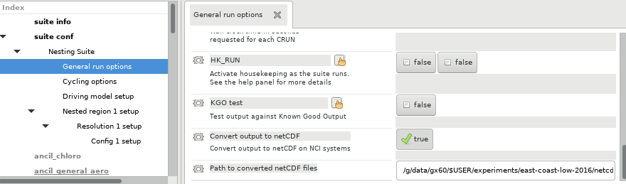

The netCDF files are created by the `um2netcdf4` python package, which uses `iris` to create the netCDF files. This task runs on 26 sapphire rapids cores (`normalsr` queue) and completes in about 20 minutes.

### `verify_nc`
This task uses `iris` and `xarray` to verify that the netCDF files created in the `convert_to_nc` task are correct. This task runs on one Sapphire Rapids node (`normalsr` queue, 104 cpus) and completes in about 10 minutes.

## Restart and Spinup

There are two different run styles for the AUS2200 suite used in experiments, they are the 'continuous' and 'restart' style runs. The continuous run style is fairly straight forward. All that is necessary to configure is the `INITIAL_CYCLE_POINT` and `FINAL_CYCLE_POINT`, and the model will run in 6-hour cycle points between those two time stamps. 

Restart style runs are more complex, as each restart may require spin-up time, and output fields may need to be carried over between overlapping suite runs.The AUS2200 suite has the ability to manage this, specifically for soil moisture fields. The suite can be configured to carry over soil moisture data between 24-hour restart runs. This is controlled by a combination of the `create_soil_moisture_ancil` task, and the input into the `aus2200_d0198_RA3_um_recon` task. To enable soil moisture carry-over, set `SOIL_MOISTURE_CARRYOVER` to true, and set `SPINUP_HOURS` to an integer values 

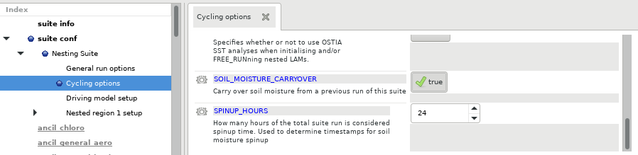.

Spin up hours is only used in restart runs, and determines how many hours of the model run are estimated to be required to 'spin-up' the atmosphere model. Typically, the model is restarted every 24 hours, and run for `24 + SPINUP_HOURS` model hours,  with the first `SPINUP_HOURS` discarded. In order for the soil moisture carryover to work, the suites must adhere to a strict naming convention that allows the `create_soil_moisture_ancil` task to derive the name of the previous restart suite. The convention is as follows:
```{admonition} Suite naming convention
For a suite named u-ab123 with an initial cycle point of 20010101T0000 with `SPINUP_HOURS` set to 24, and set to run for 48 hours, the soil moisture will be carried over from the model dump created at cycle point 20001231T1800 of the cylc suite named `u-ab123-20001231T0000`. The `rose date` function is used to calculate the date stamps for the previous suite, but this does rely on `SPINUP_HOURS` being set correctly.
```
The `create_soil_moisture_ancil` task is configured to wait for the completion of the `aus2200_d0198_RA3_um_fcst_000` task from the previous suite. Therefore, it is possible to run multiple versions of the AUS2200 suite that rely on soil moisture carryover simultaneously. This will allow initial and boundary conditions to be created and cached ahead of time, whilst the reconfiguration and model run tasks will only commence when the data required is present. This saves a significant amount of resources, as it is typical for model runs to overlap due to the required spinup time. Later model runs can therefore use cache boundary conditions created for earlier cases.

### Typical restart workflow

A typical daily restart run will require multiple copies of the AUS2200 suite to run simultaneously. The following encapsulates the workflow for the AUS2200 model run described [here](https://forum.access-hive.org.au/t/experiment-proposal-simulating-east-coast-low-complex-in-early-june-2016-using-aus2200/1507). The simulations took place over 2-9 June 2016 with a 2-day soil moisture spinup preceding the full simulation. The simulation was restarted every day, and run with a 24 hour spin-up time. This means that a total of 9 variants of the AUS2200 suite were run.

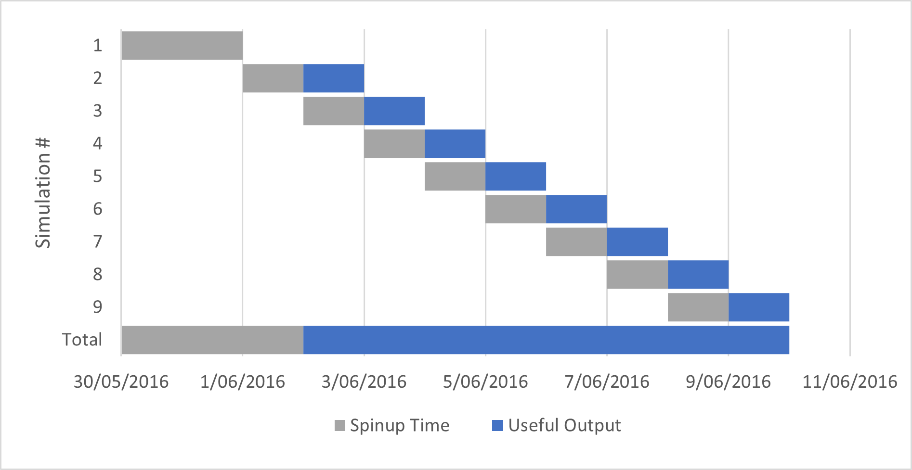

Therefore, the full model run needs to start on the 30th of May 2016. For this initial simulation, `SOIL_MOISTURE_CARRYOVER` must be false, item `1` in the 'Configure ancils and initialise dump fields' section of the `um` task must be set to ignored, `INITIAL_CYCLE_POINT` must be set to 20160530T0000Z, and `FINAL_CYCLE_POINT` must be set to 20160531T1800Z. Submit this suite with `rose suite-run`.

In your `~/roses` directory, make a copy of the AUS2200 suite, following the naming convention outlined [above](#restart-and-spinup). This example uses `u-cs142` for the original suite id.
<terminal-window lineDelay=0>
    <terminal-line data="output"><span style="color:#A6CE39">u-cs142</span><span style="color:#FAA619">\$&nbsp;</span>cd ..</terminal-line>
    <terminal-line data="output"><span style="color:#A6CE39">roses</span><span style="color:#FAA619">\$&nbsp;</span>cp -r u-cs142 u-cs142-20160601T0000</terminal-line>
    <terminal-line data="output"><span style="color:#A6CE39">roses</span><span style="color:#FAA619">\$&nbsp;</span>cd u-cs142-20160601T0000</terminal-line>
    <terminal-line data="output"><span style="color:#A6CE39">u-cs142-20160601T0000</span><span style="color:#FAA619">\$&nbsp;</span>rose edit</terminal-line>
</terminal-window>
With the rose config editor window open, change `INITIAL_CYCLE_POINT` to match the date stamp of the directory, set `FINAL_CYCLE_POINT` to 20160602T1800. Re-enable `SOIL_MOISTURE_CARRYOVER` and ensure `SPINUP_HOURS` is set to 24. Ensure that item `1` in the 'Configure ancils and initialise dump fields' section of the `um` task has been re-enabled. 

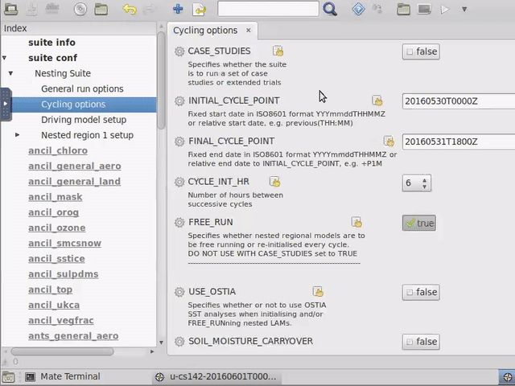

Once this is done, the suite can now be started with `rose suite-run`. At this point, the driving model reconfiguration tasks and and `create_soil_moisture_ancil` will run. As a 24 hour spinup time has been requested, `create_soil_moisture_ancil` will expect the file `$HOME/cylc-run/u-cs142-20160531T0000/share/cycle/20160531T1800Z/aus2200/d0198/RA3/ics/umnsaa_d006` to exist in order to extract the soil moisture fields. Create a symlink with the following name in your `~/cylc-run` directory
<terminal-window lineDelay=0>
    <terminal-line data="output"><span style="color:#A6CE39">cylc-run</span><span style="color:#FAA619">\$&nbsp;</span>ln -s u-cs142 u-cs142-20160531T0000</terminal-line>
</terminal-window>
From this point, create a copy of `u-cs142-20160601T0000` and move `INITIAL_CYCLE_POINT` and `FINAL_CYCLE_POINT` forward by one day. 
<terminal-window lineDelay=0>
    <terminal-line data="output"><span style="color:#A6CE39">u-cs142-20160601T0000</span><span style="color:#FAA619">\$&nbsp;</span>cd ..</terminal-line>
    <terminal-line data="output"><span style="color:#A6CE39">roses</span><span style="color:#FAA619">\$&nbsp;</span>cp -r u-cs142-20160601T0000 u-cs142-20160602T0000</terminal-line>
    <terminal-line data="output"><span style="color:#A6CE39">roses</span><span style="color:#FAA619">\$&nbsp;</span>cd u-cs142-20160602T0000</terminal-line>
    <terminal-line data="output"><span style="color:#A6CE39">u-cs142-20160602T0000</span><span style="color:#FAA619">\$&nbsp;</span>rose edit</terminal-line>
</terminal-window>
Then run the newly modified suite with `rose suite-run`. Repeat this for the six remaining starting cycle points. There is no limit to how many cylc suites can be run simultaneously. The order of the tasks between suites is controlled by the `create_soil_moisture_ancil` tasks. The AUS2200 reconfiguration task will not be permitted to start until the corresponding cycle point from the previous suite has completed. All suites can then be left to run to completion.

## Run Configurations

There have been three different driving model configurations used in AUS2200 experiments. By default, this will be the ERA5Land + ERA5 configuration. The model can also be configured to merge BARRA2 fields in with the ERA5Land data, or can be configured to run with BARRA2 as the driving model.

### ERA5Land + ERA5

Typically, ERA5Land + ERA5 data will be used as the driving model. This is facilitated by the `nci_era5grib` task, which combines ERA5Land and ERA5 data into GRIB forecast fields which can then be read by the [driving model reconfiguration tasks](#nci-era5grib).

### ERA5Land + BARRA2 soil

Initialising with ERA5Land + BARRA2 soil is currently a fairly non-trivial process. The first step is to request the level 0A BARRA2 data for the starting day of the simulation spinup. Typically, this will be 3 days before the beginning of the output window to allow 2 days to spinup the soil moisture, and a further day to spinup the atmosphere. Once downloaded, configure the suite copy as follows:
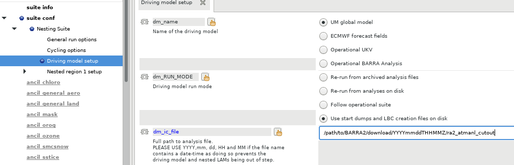
The key settings are:
 * `dm_name` : UM global model
 * `dm_ic_file`: Set this to the path to the downloaded BARRA2 data, note that the downloaded data will come in a directory with a name corresponding to the ISO timestamp of the data. This ISO data must be replaced with `YYmmddTHHMMZ`
 * It is not necessary to modify `dm_lbc_files` for this configuration.
 * Disable the `1`, `2` and `3` entries under 'Configure ancils and initialise dump fields' as per the [`create_soil_moisture_ancil`](#create-soil-moisture-ancil) section.

 Start the suite as follows:

 <terminal-window lineDelay=0>
    <terminal-line data="output"><span style="color:#A6CE39">u-cs142-barraic</span><span style="color:#FAA619">$&nbsp;</span>rose suite-run --no-strict -- --hold</terminal-line>
</terminal-window>

The suite in its current state fails strict validation, and only 4 tasks within the suite need to run. Once the cylc gui appears, release the `install_cold_idl`, `install_cold_hpc` and `install_glm_startdata` tasks. Once these tasks have completed, right click the `aus2200_d0198_RA3_um_recon` task and select 'Trigger (run now)'

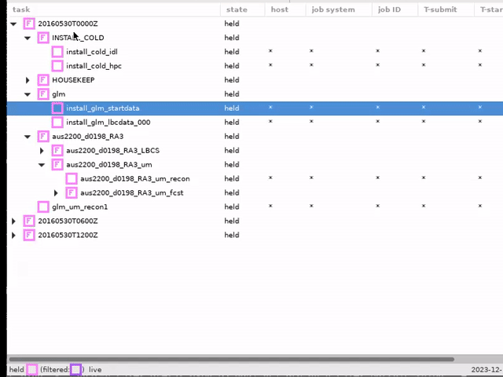

In order to have the spinup suite automatically create the soil moisture ancil, use the soil moisture carryover machinery. In a new copy of the original suite, enable `SOIL_MOISTURE_CARRYOVER` as per the [`create_soil_moisture_ancil`](#create-soil-moisture-ancil) section and create the following symlinks. Note that the dates are carried over from the [Typical restart workflow](#typical-restart-workflow) section (2-9 June 2016)

 <terminal-window lineDelay=0>
    <terminal-line data="output"><span style="color:#A6CE39">cylc-run</span><span style="color:#FAA619">$&nbsp;</span>cd u-cs142-barraic/share/cycle/20160530T0000Z/aus2200/d0198/RA3/ics</terminal-line>
    <terminal-line data="output"><span style="color:#A6CE39">ics</span><span style="color:#FAA619">$&nbsp;</span>ln -s RA3_astart umnsaa_da006</terminal-line>
    <terminal-line data="output"><span style="color:#A6CE39">ics</span><span style="color:#FAA619">$&nbsp;</span>cd ~/cylc-run</terminal-line>
    <terminal-line data="output"><span style="color:#A6CE39">cylc-run</span><span style="color:#FAA619">$&nbsp;</span>ln -s u-cs142-barraic u-cs142-20160529T0000</terminal-line>
</terminal-window>

This will cause the `create_soil_moisture_ancil` task to believe that the `astart` file generated from the BARRA2 reconfiguration task is actually a restart file from the `u-cs142` suite run for 29th May 2016, one day before the start of the spinup time. This does not affect any other part of the spinup suite and avoids the need to manually create the soil moisture ancillary. From there, enable `1` in 'Configure ancils and initialise dump fields' for the initial 2 day soil moisture spinup suite, and run the remainder of the suites as per the [Typical restart workflow](#typical-restart-workflow) section.

### BARRA2

The standard RNS suite contains the ability to run with BARRA2 initial conditions, though using this data for AUS2200 simulations requires minor file structure changes. The first step is to request the level 0A BARRA2 data for the entire duration of the model run. Once the data has been retrieved, unzip all of the `frames-a.tar.gz` files from within each of the directories:
<terminal-window lineDelay=0>
    <terminal-line data="output"><span style="color:#A6CE39">BARRA2</span><span style="color:#FAA619">$&nbsp;</span>for i in *; do pushd \$i; tar -xzf frames-a.tar.gz; popd; done</terminal-line>
</terminal-window>

Once this command is complete, clone the git repository at github.com/coecms/AUS2200_postprocessing and modify the script `separate_ancil.py` to point to the top directory containing all of the relevant BARRA2 data. Then run the script with the conda/analysis3 and um modules loaded
<terminal-window lineDelay=0>
    <terminal-line data="output"><span style="color:#A6CE39">AUS2200_postprocessing</span><span style="color:#FAA619">\$&nbsp;</span>module use /g/data/hh5/public/modules</terminal-line>
    <terminal-line data="output"><span style="color:#A6CE39">AUS2200_postprocessing</span><span style="color:#FAA619">\$&nbsp;</span>module use ~access/modules</terminal-line>
    <terminal-line data="output"><span style="color:#A6CE39">AUS2200_postprocessing</span><span style="color:#FAA619">\$&nbsp;</span>module load conda/analysis3 um</terminal-line>
    <terminal-line data="output"><span style="color:#A6CE39">AUS2200_postprocessing</span><span style="color:#FAA619">\$&nbsp;</span>./separate_ancil.py</terminal-line>
</terminal-window>

Once this is complete disable soil moisture carry over, the `1`, `2` and `3` entries under 'Configure ancils and initialise dump fields' as per the [`create_soil_moisture_ancil`](#create-soil-moisture-ancil) section and ensure the that the driving model section of the suite has the following settings:

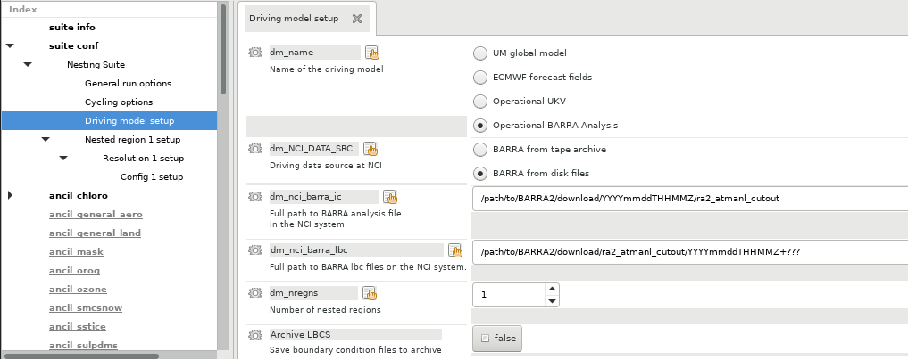

```{note}
It is advisable to disable boundary condition archiving (the `Archive LBCS` step above) as BARRA2 boundary conditions are much cheaper and faster to generate than ERA5 boundary conditions.
```

Run the suite with the `--no-strict` option enabled:
<terminal-window lineDelay=0>
    <terminal-line data="output"><span style="color:#A6CE39">u-cs142-barraic</span><span style="color:#FAA619">$&nbsp;</span>rose suite-run --no-strict</terminal-line>
</terminal-window>

The `barra_um_recon_1` task will fail, as there is no corresponding rose application for it. Once this task has failed, reset its state to succeeded, and the model will proceed without further intervention.

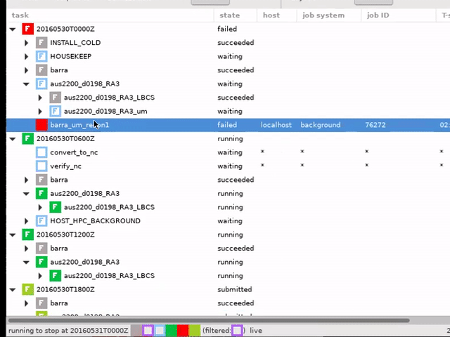

The BARRA2 configuration can be run continuously or in restart mode with or without soil moisture carry over in the same way that the ERA5-driven configuration can. 

## Acknowledgements
Thanks to Davide Marchegiani for [animated-terminal.js](https://github.com/atteggiani/animated-terminal.js). Thanks to Martin Dix and Scott Wales for resolving issues with the model.
