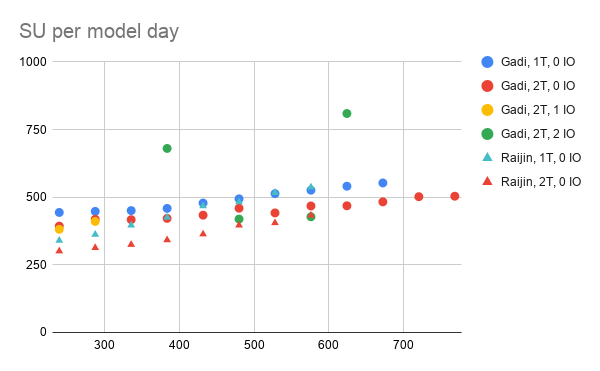
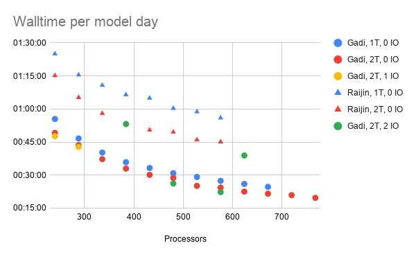

# WRF performance

This page shows the results from some experiments we run to measure WRF performance.

## Configuration

We tested the performance of WRF with the CORDEX domain with a nest over NSW, NARCliM project setup.
The configuration tested can be found at `/g/data/sx70/wrf-scaling`.

```{note}
It is possible to look at WRF performance with other domains as long as those are used by a group of people and are used over a significant period of time if possible. Please contact cws_help@nci.org.au to discuss the possibility.
```

## Results

Below is a chart showing the walltime (WT) and the SU cost per model day for different number of processors, threads and I/O quilting options.

The chart shows the data for Gadi and some for Raijin as a comparison.

In the legend, "T" indicates the number of threads (OpenMP).

One can see for this configuration that the best option is to run with 624 processors and 2 OpenMP threads. This gives the best walltime at one of the lowest cost in SU. I/O quilting does not seem to be worth using in this case.





