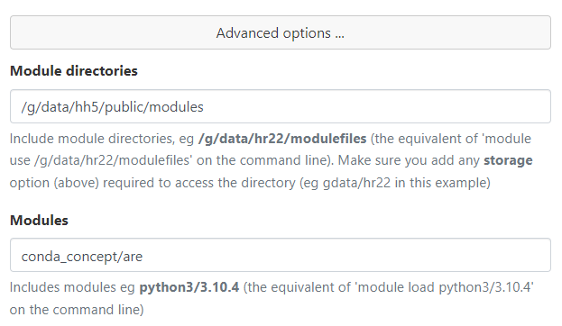

# Conda hh5 environment setup

The next-generation of the `hh5` conda environment takes advantage of containerisation in order to reduce inode usage and increase performance of the small file operations associated with some actions in python (e.g. `import`-ing packages with many dependencies). Rather than packaging a conda environment within a container, this environment takes advantage of singularity's ability to manage overlay and [squashfs](https://en.wikipedia.org/wiki/SquashFS) filesystems. This allows the 'container' to be flexible and extensible in a way that a pure container-based system cannot be. Each `analysis` conda environment is packaged in a squashfs instead of in the container directly, and one or more of these squashfs environments is mounted into a bare-bones container at runtime.

The concept combines ideas from [Singularity Registry HPC](https://singularity-hpc.readthedocs.io/en/latest/), [Rioux et al. *PEARC '20: Practice and Experience in Advanced Research Computing, July 2020, Pages 72–76*](https://doi.org/10.1145/3311790.3401776) and the current `hh5` environment in order to improve the deployment, maintenance, accessibility and performance of managed conda environments provided for Climate and Weather researchers on NCI systems.

This page is structured with usage information first, then details on the setup and configuration below that.

## Usage
### Gadi Command Line
The `hh5` conda environment can be loaded in the same way the legacy environments are:
```
$ module use /g/data/hh5/public/modules
$ module load conda_concept/analysis3-22.10
```
The stable/unstable structure will continue to be maintained, with new unstable releases every 3 months, roughly coinciding with NCI maintenance periods. 
```{note}
`conda activate analysis3-22.10` does not work at time of writing. Loading the module performs the equivalent of a `conda activate`.
```

### ARE
A special module is provided for the ARE that allows interactive access to all conda environments via a jupyter notebook and activates the current stable environment. To use it, change the following settings on the ARE launch page:




### Python shbang line
The `python3` symlink in an environment's script directory can be used as the shebang on a python script. For example:
```
#!/g/data/hh5/public/apps/cms_conda_scripts/analysis-22.10.d/bin/python3

import sys
import os
...
```
This will launch the script using the in-container python3 binary. The module does not need to be loaded for this to work, however it is advisable to load the module in advance as there are many other settings in the module file that may be required for your particular workflow.

## Motivation
The primary motivation of this work is to reduce the inode usage of the `hh5` conda environments. Presently, one of these environments can comprise over 250,000 files, directories and symlinks. This means that maintaining more than a handful of these environments can have a significant impact on the relatively small inode quotas on Gadi, potentially preventing `hh5` from being used for its originally intended purposes. By using a squashfs to contain each conda environment, the total inode count for the entire environment is reduced to one. When combined with the necessary supporting scripts, symlinks and modules, the number of inodes required for an entire analysis environment is reduced by a factor of 100-200 over a standard installation. The total inode count for a base installation with the `analysis-22.07` and `analysis-22.10` environments installed is 13,738, compared to 795,313 inodes for the same environments under the current `hh5` installation.

There are other, less immediate benefits to deploying conda environments in this manner. The first is the performance benefit achieved by having the entire environment in a single large file. This should improve access times for many of the small file operations required for e.g. python `import` statements, as there is only one file to open, the squashfs file. This reduces the number of IO operations associated with these small file operations, therefore improving performance. Another, less obvious benefit is the ability to atomically update the conda environment. By manipulating mountpoints within singularity, it is possible to update a conda environment in a different directory, or even a different file system to where it deployed. This means that, should an update fail, it can simply be discarded instead of reverted. It also means that updates are atomic, meaning that a user cannot load an environment in an intermediate state, which should improve stability.

## Overview

### Components
The containerised conda environment is comprised of the following components:
 
* An uncontainerised 'base' conda environment that exists only to install the analysis environments
* One squashfs for each analysis environment.
* In the conda `envs` directory, a symlink to each in-container conda environment path
* A launcher script that runs commands from inside the containerised environment
* A `scripts` directory that contains an entry for every file on `$PATH` within the squashfs environment.
* A TCL environment module for each conda environment.
* A base container used as a launch platform for the squashfs environments
* An install script designed to be run by a CI implementation that will install and update squashfs environments
* An initialisation script that will create the base environment.

All these components (apart from the squashfs themselves) can be found in the [`cms-conda-singularity`](https://github.com/coecms/cms-conda-singularity) repository on the coecms github.

### Layout
The above components are installed into the `/g/data/hh5/public` area as follows:
```
$ ls -l /g/data/hh5/public
drwxrwxr-x+ 2 hh5_apps hh5  4096 Dec 14 22:31 apps
drwxrwxr-x+ 2 hh5_apps hh5  4096 Dec 14 22:31 modules
$ ls -l /g/data/hh5/public/apps
drwxrwxr-x+ 2 hh5_apps hh5  4096 Dec 14 22:31 cms_conda
drwxrwxr-x+ 2 hh5_apps hh5  4096 Dec 14 22:31 cms_conda_scripts
```
```{note}
This is the ideal case, the file ownership displayed is contingent on the availability of a service user to use for software deployment. This caveat will apply every time the `hh5_apps` user appears on this page
```

The `apps` directory contains the base, uncontainerised conda environment, the squashfs files containing each analysis environment (in the `cms_conda` subdirectory) and the machinery that enables commands to be executed inside the container as necessary (in the `cms_conda_scripts` directory). The `modules` directory contains the environment modules needed to load the conda environments.

### The launcher script
The launcher script is designed to be the interface between the standard Gadi user environment and the contents of a conda environment squashfs file. It performs several checks in order to generate the correct `singularity` launcher line from outside the container or run the correct command directly if it is invoked from inside the container. Its workflow is as follows:

* Source its configuration script - There are some settings that are loaded at runtime, these are derived from a script named `launcher_conf.sh` that resides in the same directory as `launcher.sh`. 
* Parse out its own command line arguments - `launcher.sh` has some dedicated command line arguments to supply information to it in the case of the environment not being able to be set beforehand (e.g. when invoking `ssh`). Since `launcher.sh` can invoke arbitrary commands, these arguments must be processed and removed from the list of arguments to launch
* Determine the path to the `singularity` binary - Usually this will be in the conf script or provided by a command line argument. If neither of those things has happened, it will attempt to load the `singularity` module and query the location using the `which` command.
* Determine whether it is running a command or being invoked directly - if a command linked to `launcher.sh` has been run, the full argument list, minus the `launcher.sh`-specific arguments will be passed to `singularity exec`. If `launcher.sh` has been invoked directly, the program to run and its arguments are assumed to be in the arguments following `launcher.sh`.
* Determine if it is being invoked from within a container - if `launcher.sh` determines that it is already inside a singularity container, it will substitute the real path to the binary in place of its own path and run the binary directly.
* Determine if there is an override script for the command being run - If there is, run this instead of `singularity exec`
* Determine which squashfs environment(s) are required, and configure the singularity launch options as appropriate. 
* Run `singularity exec` with all the configuration gathered during the launch process.

## Maintenance
This conda environment is designed to be deployed and maintained entirely by a CI system. This includes its initial deployment. The `install.sh` script handles every action that may need to occur over the lifetime of the `hh5` conda environment. The procedure to perform common operations is detailed below

### Initialise the base conda environment
Ensure that all settings in `install_config.sh` are correct. There are a handful of items that need hard-coded paths in the installation, and they will all be derived from the values in `install_config.sh`. Then install an analysis environment. If the base conda environment does not exist, it will be created when the first analysis environment is installed.

### Install a new analysis environment
Ensure that `environment.yml` is correct and creates a valid conda environment. In `install_config.sh`, set `VERSION_TO_MODIFY` to a new value that does not exist in the current `envs` directory (e.g. 23.01 at time of writing). Push the updated `install_config.sh` to the repository. The new environment, including all modules and scripts, will be automatically created by Github actions.

### Add a new package to an existing analysis environment
Add the new package to the `environment.yml` file in the `scripts` directory in the repository. Test the installation by setting the `$CONDA_BASE` environment variable to the path of a test environment and run `install.sh`. If the tests pass interactively, push the updated `environment.yml` to the repository. The update to the production installation will be automatically deployed by Github actions.

### Update stable/unstable environment links/modules
In `install_config.sh`, change the `STABLE_VERSION` and/or `UNSTABLE_VERSION` variables to the conda environments that are becoming the stable and unstable variants. Push the updated `install_config.sh`, the symlinks and module aliases will be 
automatically updated by Github actions. 
```{note}
This will also trigger an update for the a analysis environment corresponding to the `VERSION_TO_MODIFY` variable.
```

### Revert a bad update
In most cases, if an update fails, it will be discarded and the original retained. If the build and all tests pass, but a user discovers a problem after the new update is deployed, the old one is backed up in the `admin` directory. Restore it as follows:
```
$ mv /g/data/hh5/admin/analysis-22.10.sqsh.bak /g/data/hh5/public/apps/cms_conda/envs/analysis-22.10.sqsh
```
```{warning}
The backup must be *moved*, not copied. Using `mv` makes the change between environments atomic, whereas copying will cause a partially written squashfs to be present for the duration of the copy.
```

## Technical Details

The key difference between a standard conda environment setup and the `hh5` conda is the `envs` directory. In a standard conda environment setup, the envs directory contains a series of directories corresponding to each environment. Each of these directories is a fully self-contained environment, often comprising more than 250,000 individual files. Though these files are usually [hardlinked to central package caches](https://www.anaconda.com/blog/understanding-and-improving-condas-performance), this is not reflected in filesystem quotas. Each path to a hardlinked inode is treated as a separate inode for the purposes of quota enforcement. In the `hh5` environment, the `envs` directory appears as follows:
```
$ ls -l /g/data/hh5/public/apps/cms_conda/envs
lrwxrwxrwx  1 hh5_apps hh5         15 Dec 23 11:12 analysis3 -> analysis3-22.07
lrwxrwxrwx  1 hh5_apps hh5         26 Dec 23 11:12 analysis3-22.07 -> /opt/conda/analysis3-22.07
-rw-rwx---+ 1 hh5_apps hh5 8624431104 Dec 23 11:12 analysis3-22.07.sqsh
lrwxrwxrwx  1 hh5_apps hh5         26 Jan 12 13:23 analysis3-22.10 -> /opt/conda/analysis3-22.10
-rw-rwx---+ 1 hh5_apps hh5 9634836480 Jan 12 13:23 analysis3-22.10.sqsh
lrwxrwxrwx  1 hh5_apps hh5         15 Dec 23 11:12 analysis3-unstable -> analysis3-22.10
```
```{note}
The symlink targets refer to paths that only exist inside the corresponding `.sqsh` files, and as such, they appear broken unless inspected from inside the container with the correct squashfs mounted. 
```

On loading an `analysis3-xx.yy` module (after running `module use /g/data/hh5/public/modules`), a `conda activate` command is run from inside the container in order to set the environment outside of the container to what would be expected had a `conda activate` command been run on an uncontainerised environment. The exception is that the `bin` directory inside the environment is translated to the appropriate subdirectory of `scripts`. For example, the path:
```
/g/data/hh5/public/apps/cms_conda/envs/analysis3-22.10/bin
```
becomes
```
/g/data/hh5/public/apps/cms_conda_scripts/analysis3-22.10.d/bin
```
The module also sets the `SINGULARITYENV_PREPEND_PATH` environment variable. This variable is modifies the linux `PATH` environment variable only within the container, and is required to ensure the `PATH` inside the container matches `PATH` outside of the container.

Every entry in the in-container `envs/analysis3-22.10/bin` directory is symlinked to the launcher script placed in the `analysis3-22.10.d/bin` directory. These links are programmatically generated during installation, and invoke singularity with the correct squashfs mounted, and then inspect the link name to determine which command execute the command from within the container. The launcher script also has provisions for command overrides and configuration to alter the behaviour of commands in the container if necessary. The launcher script can also be invoked directly to run arbitrary commands inside the container. For example, running `launcher.sh bash` will launch an interactive shell inside the container with all correct bind, overlay and squashfs mounts in place.

The actual container used as the base of the environment contains only enough components to create a functional environment. The container does not contain its own operating system, instead, it is comprised of a series of empty directories and symlinks. The necessary components of Gadi's operating systems are bind-mounted in at launch time through the launcher script. Though this does make the environment entirely unportable, which goes against the philosophy of containerisation, the container itself only needs to be constructed once for any given system, and reconstruction is trivial. The advantage of this approach is that the conda environment is separate to the container, and therefore multiple conda environments can be present 'in' the same container. This also means that the container can never be out of sync as Gadi's OS receives updates. This allows us to make modifications to the conda environment after installation that enhance the functionality of the environment. 

As a part of the installation process, the `openssh` packages are removed from the conda installation, which forces use of the system `ssh` and, more importantly, its configuration. The `openmpi` package is also replaced by an  `openmpi` distribution installed in `/apps` on Gadi. 
```{admonition} OpenMPI in Conda
:class: tip
This means that conda environment has a fully compatible MPI distribution with the Gadi, which solves the problem of conda installing incorrectly configured MPI distributions, and addresses the drawbacks outlined in the [Singularity documentation](https://docs.sylabs.io/guides/3.7/user-guide/mpi.html).
```

Some external programs are also linked into the scripts directory to modify their behaviour to take into account the containerised environments. For example `pbs_tmrsh`, if invoked when a conda environment is loaded, is modified to load the environment on the remote node before executing the command to be run. In time, `ssh` will also be modified to do this, however, this is significantly more complicated. There is a generic framework to add commands, remove OS packages and symlink `/apps` packages into the squashfs conda environments, determined by the contents of arrays in the `install_config.sh` file.

## Known issues
From time to time, the tests will fail with some package failing to import with `OSError` (without any other information on the type of error). If this occurs, wait a few minutes and rerun the tests from Github actions. I'm not sure what the cause is, but I suspect its a lustre synchronisation issue with large files. I have not been able to reproduce this issue consistently.