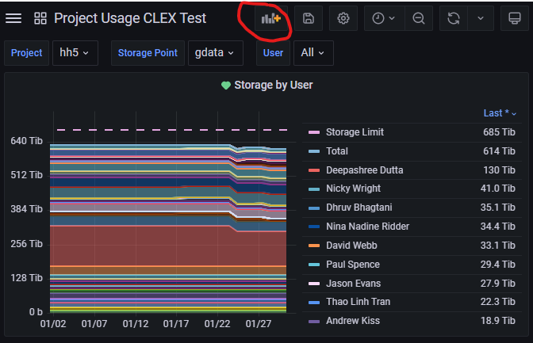
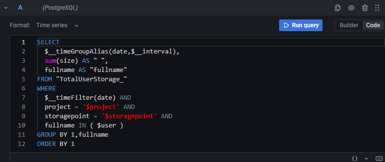
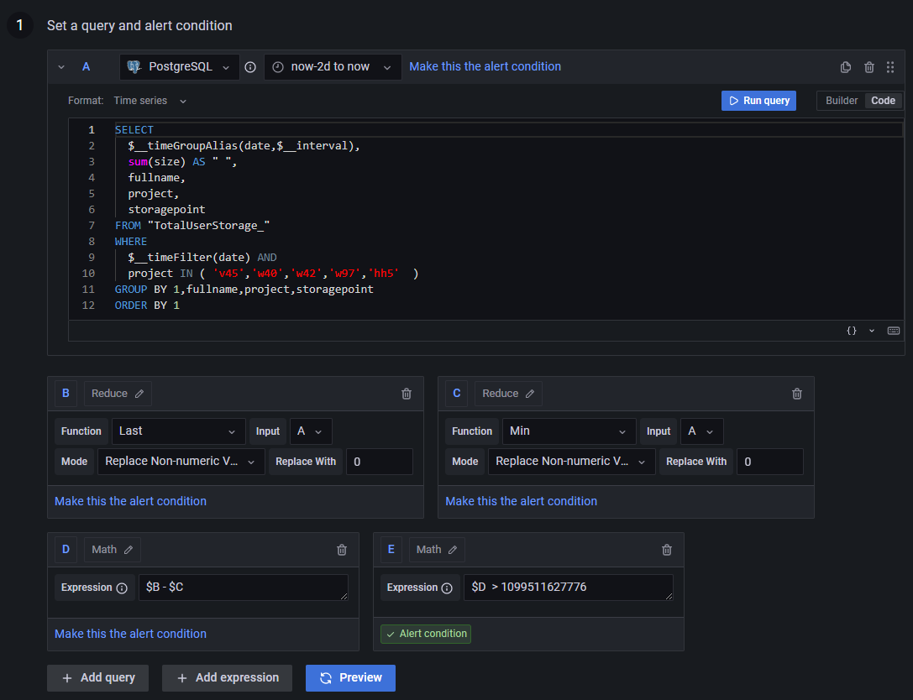
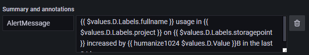
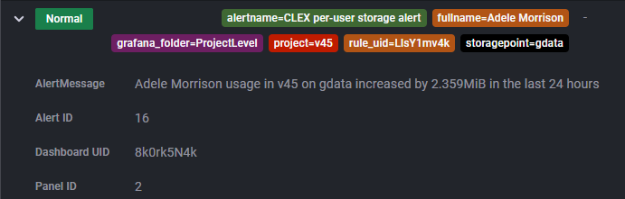

# How to create a new alert in grafana

## Setting up a time-series panel

All data in the accessdev grafana instance is configured to be retrieved from a postgres database hosted locally. To start with, it is best to create a panel based on the data you'd like an alert on. To do that, press the 'Add Panel' button in a relevant Grafana dashboard (or create a new dashboard).



From there, you'll need to construct a postgres query that retrieves the data you're interested in alerting on in the form of a time-series. 


```{note}
The first item in the `SELECT` statement must be the the grafana builtin `$__timeGroupAliases` function, the `WHERE` statement must include the grafana builtin `$__timeFilter` function and `GROUP BY 1` and `ORDER BY 1` must be present
```

In order to use variables such as usernames and projects, they must be declared at the dashboard level. To do this, select 'Dashboard settings' (cog icon from the first image), select 'Variables', then select '+ New variable'. Variables can be constructed from comma separated strings when their type is set to 'Custom', or from a postgres query when the type is set to 'Query'. In general, the list of supported categories is small, and changes infrequent enough that 'Custom' will generally suffice. The exception to this is CLEX Users, which should always be generated dynamically from a postgres query. See the [Project Usage CLEX Test dashboard](https://accessdev.nci.org.au/grafana/d/8k0rk5N4k/project-usage-clex-test?orgId=1) for an example. Setting variables and using them in dashboard queries allows the panel to be filtered using drop-down menus.

## Creating the alert
Once your panel is configured and shows the time-series data you need, click on the 'Alert' tab from the 'Edit Panel' display, and click 'Create alert rule from this panel'. At this point, you will need to construct a series of queries and expressions to get your alert in place. First, a time-series will need to be constructed. It is most likely going to be a similar time-series as the panel, but modifications must be made in order for alerts to work correctly. If you are setting up an alert for multiple users or projects, these projects must appear in the `GROUP BY` clause in the sql query, and alerts do not have access to dashboard variables, so these may need to be inserted by hand if necessary.

```{note}
Each distinct group in a `GROUP BY` clause creates a separate instance of an alert. This is required later for when slack messaging will be set up, as variables from the instances are used to construct the message.
```

A grafana alert will be triggered if the expression that defines the 'Alert Condition' is non-zero. Expressions will need to be constructed such that your time-series is reduced to 1 or 0 depending on whether your alert condition is met or not.


The image above shows the sequence of expressions that alerts us when any CLEX user has increased their storage usage on any of Gadi's file systems by 1TB in 24 hours. The data for this query is gathered once a day, so the alert period (top centre of the image) is set to between 'now-2d to now'. Expressions and time-series are referred to in subsequent expressions by the blue capital letter in the top left of each box. This name can be changed, but it usually isn't. The sequence of queries and expressions is as follows:

* **A**: Generate time series. Note the `GROUP BY` clause. In this case, there will be an instance for every distinct `fullname` (i.e. user), `project` and `storagepoint` (filesystem) combination. At time of writing, this gives 941 instances of this alert.
* **B**: Take the most recent value in the time-series generated by **A** for every combination of `fullname`, `project` and `storagepoint`. This also provides an option for how to handle missing or bad data. In this case, it is set to 0.
* **C**: Take the smallest value in the time-series generated by **A** for every combination of `fullname`, `project` and `storagepoint`.
* **D**: Subtract **C** from **B** for every combination of `fullname`, `project` and `storagepoint`.
* **E**: Return true if **D** is greater than 1,099,511,627,776 bytes (1TiB) for any combination of `fullname`, `project` and `storagepoint`.

This is a quite verbose way to go about setting up alerts, however, it is necessary to make each step as simple as possible due to the limitations of the alert templates. Alert templates cannot perform math functions, so in order to refer to the actual increase in storage usage, it must be generated in a separate expression from the alert condition. To set **E** as the alert condition (the binary that determines whether the alert is triggered or not) click 'Make this the alert condition' (this has already been in the above step).

Under section 2 'Alert evaluation behaviour', determine how often the alert conditions should be checked (the 'Evaluate every' setting), and for how long the alert condition needs to be true for the alert to trigger ('for'). For data that is gathered every 24 hours, it is pointless to check too frequently, so both fields are set to 1 hour. Note that the value in the 'for' field cannot be smaller than the 'Evaluate every' field.

## Sending to slack
Under section 3 of the Edit rule page, 'Add details to your alert', in the 'Summary and annotations' section, create a new annotation named `AlertMessage` by selecting the '+ Add New' option from the 'Choose' drop-down menu.
```{note}
The annotation must be named `AlertMessage`. This is due to the slack messaging configuration.
```


Above is the `AlertMessage` setting for the alert in the previous section. Grafana alerts use the Go templating language, which is limited to fairly simple text operations. `$values` contains all the relevant data to go in the message as class variables. The key components are
* `$values.D`: `D` refers to the expression **D** from the previous section. 
* `$values.D.Labels` contains the `fullname`, `project`, `storagepoint` combination from the alerts, which are referred to using `$values.D.Labels.fullname` etc. Each of these will be replaced by the `fullname`, `project`, `storagepoint` values that caused the alert. 
* `$values.D.Value` contains the actual number returned by the expression in **D**. `humanize1024` is a [templating function](https://grafana.com/docs/grafana/latest/alerting/fundamentals/annotation-label/example-template-functions/) provided by grafana.

In section 4, ensure that the `__contacts__` label is set to `"ARCCSS Slack"`.

Any expression in `{{ }}` is treated as a template, *unless* there is a mistake in any of the templates, at which point the entire message is treated as plain text. The correctness of the expression can be tested by saving the alert, then expanding one of the created instances and checking that the derived `AlertMessage` value looks right.


### Why `AlertMessage`?
This is a configuration option. The actual text of the notification that is sent is determined by a custom message template called 'Main Slack Template' in Alerting &rarr; Contact Points. To keep this as generic as possible, all it does is send the `AlertMessage` annotation for every triggered alert. Hence, for any useful information to appear on slack, the `AlertMessage` annotation must be set.

## Further reading
The documentation for grafana alerting is very sparse and not particularly useful. It can be found here. https://grafana.com/docs/grafana/latest/alerting/

At this point in time, the main 'documentation' for alert templating in grafana are these threads on the grafana discourse: https://community.grafana.com/t/how-to-use-alert-message-templates-in-grafana/67537, and https://community.grafana.com/t/documentation-of-alert-templating-in-serious-need-of-improvement/76083
