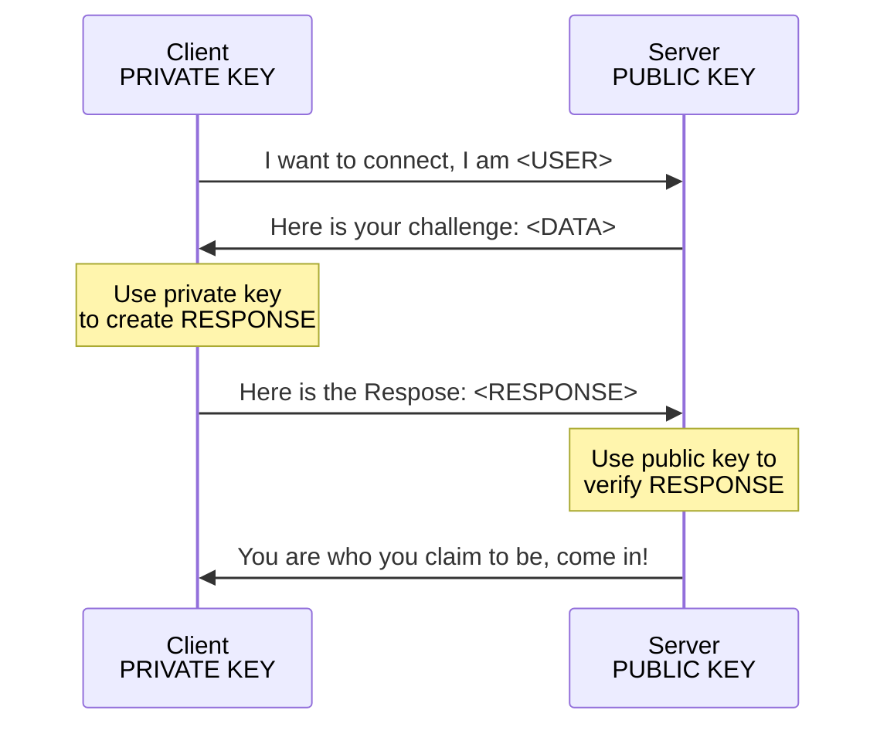
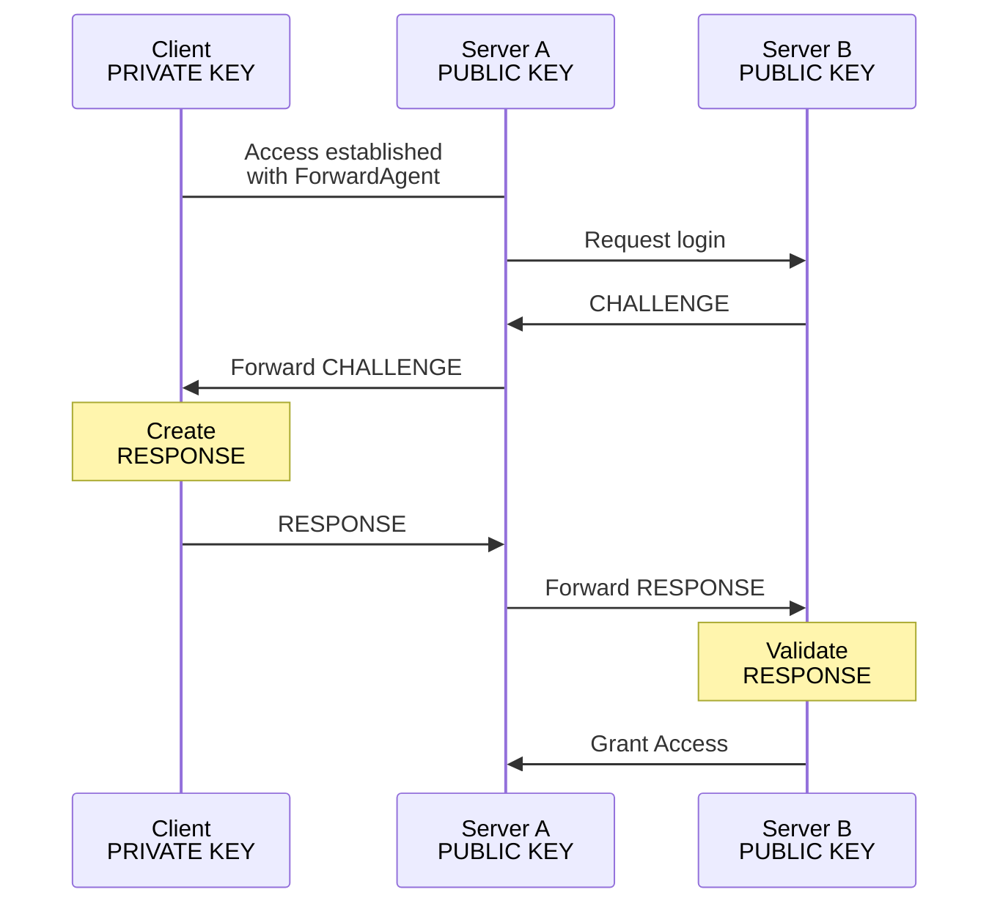

# Set up SSH connection

## What is SSH?
SSH stands for "Secure Shell" and is a way to access to a remote computer over an encrypted connection. By default, it will provide the standard shell terminal on the remote machine.

There are a few features that SSH provides that are very useful in certain situations, some of which will be explained below.

## What are SSH Keys?
In order to ensure that the person logging into a remote system is the person that they present to be, an authentication has to occur. The most well known authentication method is the password.
This requires the client (user) to provide the password to the server, where it has to be compared to a stored version. While generally acceptable, there are better ways.

Keypairs are a fascinating technique that you can read more about on [Wikipedia](https://en.wikipedia.org/wiki/Public-key_cryptography). For the purposes of this documentation it's sufficient to know this:

A keypair consists of two files, called public and private key. These two files are created together in such a way that they are strongly correlated, but it's practically impossible to create one just from the other. 
This correlation allows a computer that has access to the public key to verify that another computer has the private key *without ever receiving the private key*, before or during the challenge.

**The private key should stay private and never leave the computer that it was created on.**


There is more going on, for example the server also authenticates itself to the client using a similar technique, but this should be all for now.

It is good practice to always have the private key protected by encrypting it with a strong password (passphrase), this will automatically happen during key generation. 

**If the private key is not encrypted, any malicious virus or attacker that obtains access to your computer can steal the private key and then impersonate you on the server.**

### Creating an SSH key pair

There are different types of SSH key algorythms that all work slightly different. You can use the default, **RSA**, if you create a long enough key:

```bash
$ ssh-keygen -t rsa -b 4096
```

You will be asked for the file location (leave it at the default `$HOME/.ssh/id_rsa`), and for a passphrase (which is just another term for a password). Please chose a strong one that you can remember. Consider using a [Password Manager](https://www.wired.com/story/best-password-managers/)

## What is an SSH Agent?
We can make things more convenient for the User by storing the unencrypted private key in memory on the user's machine. This is still reasonably safe, as it's much harder to retrieve something from another process' memory than just reading a file from disk.

The service that offers this functionality is called an ssh agent.

Depending on your operating system, this will work differently. Linux desktop systems will often come with an SSH agent running in the background. On MacOS machines you can use the keychain. Windows is a bit harder, as it doesn't come with SSH functionality out of the box.

## Configuration of the SSH system
The default location for everything SSH is in your home directory the `.ssh` subdirectory. This contains any or all of these files:

- `config` -- The SSH configuration file
- `known_hosts` -- The file with the public keys of servers that you have accessed in the past. (This is relevant if this system is a client)
- `authorized_keys` -- The file containing all public keys that are allowed to be used to log you into this system. (This is relevant if this system is a server)
- `id_rsa` -- the private RSA key. Other flavours might be called differently, e.g. `id_ed25519`
- `id_rsa.pub` -- the public RSA key. Again, the filename will vary based on the type of key.

### The config file
If you don't know what to write in your config file, just copy the block below into the file `$HOME/.ssh/config` and replace the word `USER` with your NCI username:
```none
Host *
	IgnoreUnknown UseKeychain
	AddKeysToAgent yes
	UseKeychain yes
	
Host access
	HostName accessdev.nci.org.au

Host gadi
	HostName gadi.nci.org.au

Host access gadi
# In the line below, replace USER with your NCI username
	User USER
	ForwardAgent yes
	ForwardX11 yes
	ForwardX11Trusted yes
```

### Copying the key files to the servers
Now that the client is configured and knows which server is meant by `access` and `gadi`, it's time to copy our public keys over to these servers:
```bash
$ ssh-copy-id gadi
```
You might be asked to verify the server. Remember how we said before that the server also authenticates to the client? If you have never connected to gadi from your system, it doesn't know the server yet and can't verify it. There's a complex methodology consisting of verifying so-called fingerprints, but everyone simply accepts the authenticity at this stage. 

You will also be asked to enter your NCI password. Remember, before you run this command, `gadi` doesn't know your SSH keys yet.

The script will then add your public key to the server's `$HOME/.ssh/authorized_keys` file and tell you what it did. You can now use the command
```bash
$ ssh gadi
```
to log into gadi. You might be asked about the key's passphrase if it hasn't been loaded into the SSH Agent yet. This is the passphrase you chose during the creation of the keypair.

Verify that you are logged into gadi after running this command.

Log back out, either by typing `exit` or pressing `CNTL-D`. You should be back on your computer. Now do the same for `accessdev`:
```bash
$ ssh-copy-id access
```
You should now be able to log into accessdev without having to enter any password:
```bash
$ ssh access
```

From accessdev, log into gadi:
```bash
accessdev$ ssh gadi
```

You should find that it works without having to enter another password. How is that?

## SSH Agent forwarding
Remember the line `ForwardAgent yes` from the configuration? That means that challenges will be forwarded to the agent on your computer, like this:


So while you are connected to `accessdev`, you can keep connecting to other services. But also note that ssh itself doesn't have a configuration on accessdev yet. The simple `ssh gadi` only worked because
1. `accessdev` and `gadi` have the same `.nci.org.au` extension, and
2. your username on `accessdev` and `gadi` is the same.
In fact, as we haven't added further agent forwarding to this new connection, trying to connect from `gadi` back to `accessdev` should fail, or more precisely require the entry of the NCI password.